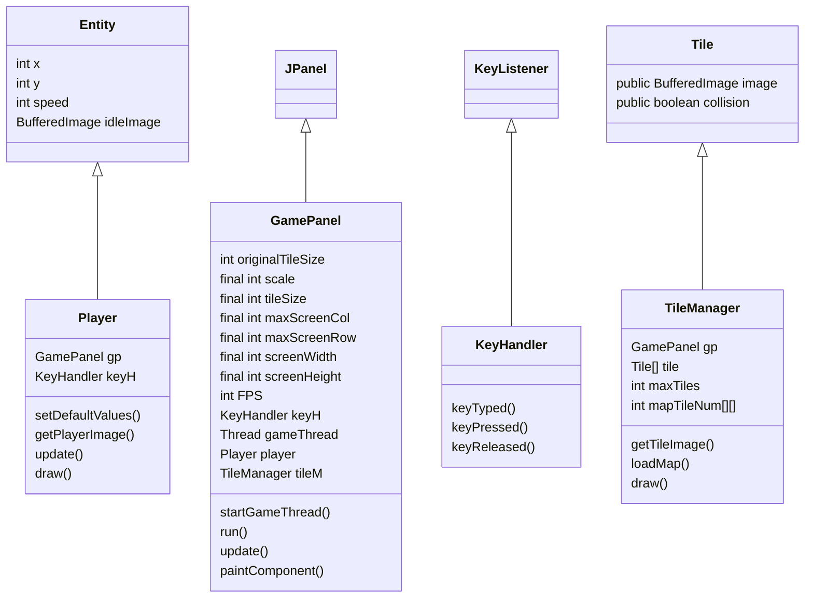

# Launch 
lanch the main under an eclipse project will work.

# Proj

Jeu type Isaac\
On a les maps\
On a les colisions

On doit rajouter la barre de vie\
déplacement zqsd \
Présence d'ennemi mobile\


Map -> generateur semi-aleatoire (dis-continu)

Perso -> deplace (vitesse, vie, attaque face au joueur, defence en face bp)

Mob -> (vitesse, vie, attaque, type)

Props -> (Etat Colision, Colectible, detruisable)

Item -> (effect sur le Perso)
https://github.com/mermaidjs/mermaidjs.github.io/blob/master/classDiagram.md

<<<<<<< HEAD
```Diagramme de classe```
=======
Timer (le temps)

>>>>>>> origin/Create_Hero


```Explanation```

The game is an Adventure game. It will be an Isaac type game. We play as a character who must walk from room to room to find the boss, kill him to win the game. Each room will be different, will contain random objects that will increase the stats of the character. In the rooms, the hero will be confronted with different types of mobs. They will be of 2 types: Ground and flying. The objects will have life points. If their life point reaches 0, the object will be destroyed and the player will not be able to collect it.

```List of attending classes```

```
Entity
```
Mother class to represent an object on the map. It will be inherited by several classes. This class takes only 3 attributes.

```
Player
```
Class representing the player. This one inherits from the Entity class. This class takes 4 methods: 
 - setDefaultValues() : initialize values to defaults
 - getPlayerImage(): Returns an image of the player
 - update(): Updates the player's state
 - draw(): Draws the player on the screen

```
GamePanel
```
Class allowing to set up the screen. This class extends the JPanel class and implements the Runnable interface.
This class takes 4 methods : 
 - startGameThread() : initialize the game and run it
 - run(): Update every 0.01 seconds the game variables
 - update() : Calls the update of the player
 - paintComponent() : Draw all objects on the screen

```
KeyHandler
```
The KeyHandler class is a method to see which key has been pressed and/or released. It has 3 methods:
 - keyTyped(): Not yet used
 - keyPressed() : Allows you to retrieve the typed key
 - keyReleased(): Retrieve the released key

```
Main
```
Main class that displays the screen

```
Tile
```
Mother class which allows to represent a tile. It has 2 attributes :
 - BufferedImage image; // The image
 - boolean collision : // Allows to know if there is a collision

```
TileManager
```
Class inheriting from Tile and which manages the cells of the map with the help of an array. It has 3 methods:
 - getTileImage(): Get the images to display the tiles
 - loadMap() : Allows to generate the map
 - draw(): Allows to draw the tile

